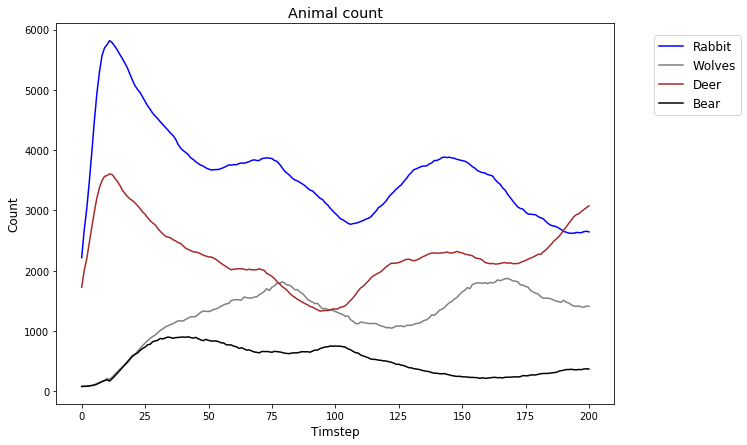

 # Reproducibility guide (user tests)
<font size=4 color='gray'>Alexander Bruun, Anton Paris, [Project Survival on GitHub](https://github.com/parisj/project_survival)</font>

***

### Tabel of content
1. <b>Requirements</b> <br>


2.  <b>Overview</b> <br>
    2.1 Variables <br>
    
    
3.  <b>Reproduce results</b><br>
    3.1 Light Test<br>
    3.2 Heavy Test<br>
    
    
4.  <b>Trouble shooting</b>

##  1. Requirements
***

### For the jupyter notebook to run, following packages are needed: 

 <b>jupiter notebook:</b> - [install Jupiter Notebook documentation](http://jupyter.org/install) <br>

***
#### In the notebook used packages: 

>`pandas==0.23.4`<br>
>
>`numpy==1.15.1`<br>
>
>`matplotlib==3.0.0`<br>


## 2. Overview
***

### 2.1 Variables (User Imput)
>`r_dim ` Amount of rows<br>
>
>`c_dim`  Amount of columns<br>
>
>`offspring_chance_table` Chance for offspring<br>
>
>`rules` List of priority for each animal (Where does the animal preferes to go) <br>
>
>`values_offspring` Cell must have at least this value to be able to create offspring <br>
>
>`eat_values` Value gained by eating an cell <br>
>
>`death values` List, increases `death_probability`each turn  <br>
>
>`cost_reproduction` Cost for creating offspring <br>
>
>`cost_movement` Cost for moving  <br>
>
>`nutrition_level_start` Start Value for new cells and offspring <br>
>
>`nutrition_value_each_turn` Nutrition value that the prey gains each turn  <br>
***

 <a id="meaning_list"></a>
#### Meaning of the index in Lists  
Sets parameters for Cells with the state equal to the index! <br> 
><b>list_name[ i ]= [0]Forest, [1]=Rabbits, [2]=Wolves, [3]=Deers ,[4]=Bear </b>
   

## 3. Reproduce Results
***

### 3.1 Light test  &ensp; <font size=2.5 color='gray'> - (Oscillations 100x100 grid)</font>


`use these values to create an oscillating environment`


```python
#Run with heavy test cell commented out 

#Oscillations 100x100 
r_dim= 100
c_dim= 100
cells=[]
max_steps=200

offspring_chance_table=[0,100,100,100,100]
values_offspring=[0,1,1,1,1]
eat_values=[0,1,1,1,1]
nutrition_value_each_turn= 4
cost_reproduction=1.5
cost_movement=1.5
nutrition_level_start=5
death_values=[0,0.091,0.167,0.05,0.033]
rules= [[0],[0],[1,3,0,4],[0],[3,1,0,2]]

#Population represented animals 
population=[0,1,2,3,4]

#Represents the probasbility for an animal to be initialized in the Grid
probability=[0.7,0.25,0.01,0.2,0.01]
```

#### What should you get?
The initialization of the grid is random and results may vary. Run the simulation again <br>

You should be looking at a plot like this: 



If wanted, uncomment the animation cells (highly advised, but keep in mind the `increased processing time`)

### 3.2 Heavy test

#### For recreating all the result, the documentation of our report has all the parameter in tables

Results for: <br>
Case: `Extinction`, `Overload` `Oscillation` <br>
in 3 different dimensions
`20x20` , `50x50`, `100x100`, <br> 

then by deleting the light test cell and adjusting the Heavy test cell in the notebook (need to uncomment) all the test can be tried to reproduced!


## 4. Trouble shooting

####  Not getting the wanted result:
> 1. The grid is randomly initialized and sometimes result vary, try it again. If problem consist try next step: 
>
>
> 2. Restart and re-run the whole notebook. This clears all the variables and outputs
>
>
>3. Check if all packages are installed correctly and the requirements are met
>
>
>4. If it's still not running or not producing the wanted results restart your PC 


```python

```
